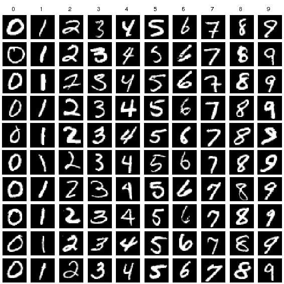
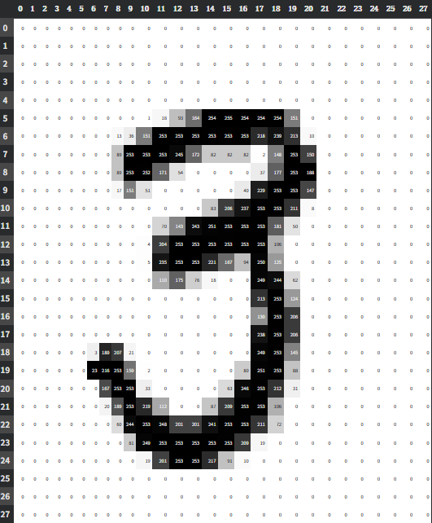
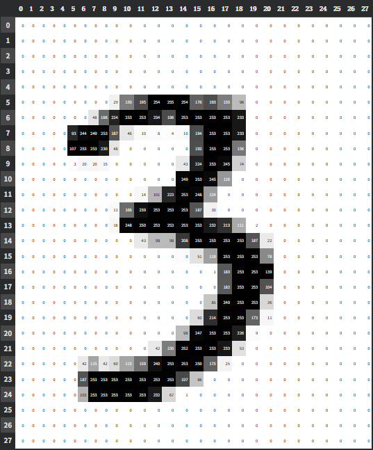
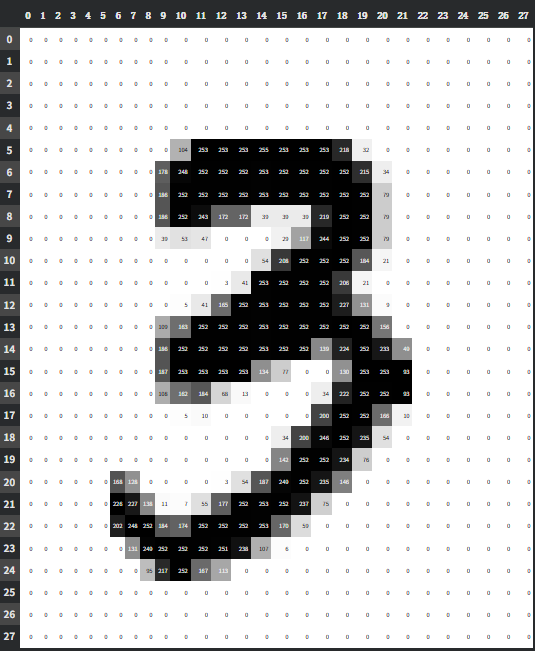
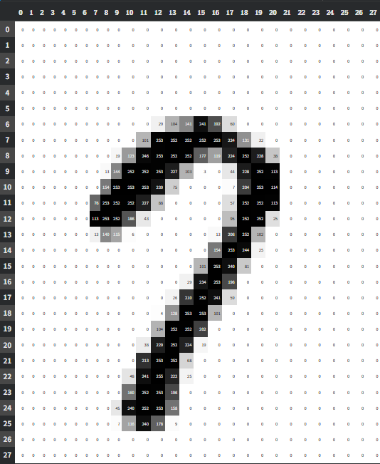

# Neural Network CH.1 MINST

## Prologue

Before we talk about Neural Networks. We should first think about the minimal unit of the Neural Network: the Neuron.

A Neuron contains the two key components:

- **Trainable parameters** (weights and bias)
- An activation function

$z=w_1x_1+w_2x_2+\cdots+w_nx_n+b$

$a=\sigma(z)$

A neuron accepts multiple inputs and outputs a single value through the mathematical function inside it — which can be sigmoid, ReLU, tanh, or other activation function.

To be noticed, this neuron is not biological neuron, it is merely inspired by how biological brains work.

## MINST

why neural networks are so special? One reason for that is neural networks are trainable.

In this video, I'm going to use a neural network to solve a real-world problem: the MNIST problem.

What is MINST? It's a dataset of handwritten digit images collected by the National Institute of Standards and Technology. This dataset helped make LeNet the defining architecture for convolutional neural networks





Each image in the dataset is a 28×28 grayscale image, where each pixel value ranges from 0 to 255.

## Pixel Similarity Algorithm

Try to think about, We have three images here, we can  immediately tell they're all  number three, rather than other numbers.






It's an easy task for our human brains to recognize, but its hard for the computer. For a computer, the three images are so different.

Based on what we already know — that each image is a 28×28 grayscale image — if we're given an image, how do we build a system to distinguish between the number 3 and the number 7?




The simplest method is pixel similarity.

(Switch to Google colab)

To prepare the data, we combine the images into a rank-3 tensor using torch.stack,  and normalize the pixel values from a 0-255 range down to a 0-1 scale.

then we apply the mean function across all training images to calculate the average pixel value for each position. this is the perfect number 3 and perfect number 7 according to our calculation.

Now, we only need to calculate the distance between the given image and our 'perfect' 3, and compare that to the distance between the given image and our 'perfect' 7. If the distance to the 3 is smaller than the distance to the 7, it's reasonable to assume—or classify—that the given image is a 3.

So, how do we calculate the distance? Since images are just numbers, we can compare them pixel by pixel.

We take the absolute difference between each pixel in our given image and the corresponding pixel in the 'perfect' image. Then, we calculate the mean of all those differences. This is called the Mean Absolute Error, or L1 loss.

- Mean Absolute Error (L1 Norm)
- Root Mean Squared Error (L2 norm)

Try to think about: could we just use a sum function here instead of a mean? The answer is a bit of 'yes and no.'

But anyway, let's look at the results. Our simple pixel similarity algorithm gets 91% accuracy for identifying 3s, and 95% accuracy when classifying all the numbers. That's actually pretty cool.

But there's a catch. This is a completely fixed pattern. It's just memorizing an average. What if we want a system that can actually improve and learn by itself?

## Loss Function

Loss function or cost function is to quantify how well we're achieving this goal

We use mean squared error or just MSE as the loss function.

$$C(w,b) \equiv \frac{1}{2n} \sum_x \|y(x) - a\|^2$$

Here, w denotes all the weights of the neural network, b all the biases. n is the total number of training data. x is the input sample, and y is the real value. a is the predict of the neural nerwork.

Our goal in training a neural network is to find weights and biases which minimize the quadratic cost function  C(w,b)

## SGD

How to minimize the cost function, the answer is: Gradient Descent.

Imagine you're standing somewhere on a mountain.
You want to reach the lowest point in the valley.

But there's a problem. It's dark. You can't see the whole mountain.

The only information available is the slope beneath your feet.

If the ground slopes downward to the left, you take a step left. If it slopes downward to the right, you step right.

By repeatedly moving in the direction of steepest descent, you will gradually approach the bottom of the valley.

Suppose we have a squared function:

$f(x)=x^2$

The derivative tells us how rapidly the function changes at a particular point.

$f'(x)=2x$

At (x=3),

$f'(3)=6$

which means the function is increasing rapidly.

At (x=-3),

$f'(-3)=-6$

which means the function decreases as we move to the right.

so if Gradient is bigger than 0, we go left, if gradient is smaller than 0, we go right

In higher dimensions, derivatives become gradients.

Instead of a single number, the gradient is a vector containing the derivative with respect to every parameter.

$\nabla C=
\left(
\frac{\partial C}{\partial w_1},
\frac{\partial C}{\partial w_2},
\cdots,
\frac{\partial C}{\partial b}
\right)$

The learning rate determines how large each step will be.

$w=w-\eta\frac{\partial C}{\partial w}$

$b=b-\eta\frac{\partial C}{\partial b}$

## Implementing the NN

```python
import numpy as np

class NN:
    def __init__(self, layer_sizes, seed=42):
        self.layer_sizes = layer_sizes
        self.num_layers = len(layer_sizes)
        

```

## Good learning resources

- http://neuralnetworksanddeeplearning.com/chap1.html
- https://www.bilibili.com/video/BV18m411S79t
